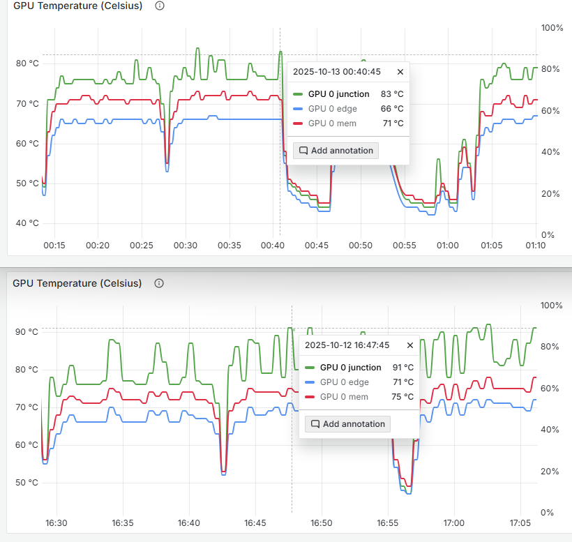

import DocCardList from "@theme/DocCardList";

# Perf tuning

## Force PCIE speed

```bash
curl -L https://github.com/corundum/corundum/raw/refs/heads/master/fpga/lib/pcie/scripts/pcie_set_speed.sh > pcie_set_speed.sh
chmod +x pcie_set_speed.sh

# PCI bridge: Advanced Micro Devices, Inc. [AMD/ATI] Device 14a0 (rev 01)
AMDGPU_DEVICES=(
  '17:00.0'
  '1a:00.0'
  '31:00.0'
  '4b:00.0'
)
for (( i=0; i<${#AMDGPU_DEVICES[@]}; i++ )); do
  sudo ./pcie_set_speed.sh "${AMDGPU_DEVICES[$i]}"
done
```

## Overclock / PowerLimit

upp - https://github.com/sibradzic/upp

```bash
# PP parameters
echo '
SmallPowerLimit1: $TDP_MAX
SmallPowerLimit2: $TDP_MAX
BoostPowerLimit: $TDP_MAX
PowerSavingClockTable:
  PowerSavingClockMax:
    PowerSavingClockMax 0: $GPU_MAX
smcPPTable:
  SocketPowerLimitAc0: $TDP_MAX
  SocketPowerLimitDc: $TDP_MAX
  TdcLimitGfx: $TDC_MAX
  FreqTableGfx:
    FreqTableGfx 8: $GPU_MAX
  FreqTableUclk:
    FreqTableUclk 2: $MEM_MAX
    FreqTableUclk 3: $MEM_MAX
  DcModeMaxFreq:
    DcModeMaxFreq 0: $GPU_MAX
' > mi50-oc.yaml.tpl

# Stock values for 016.004.000.064.016969
echo '
export MEM_MAX=1000
export GPU_MAX=1725
export TDP_MAX=225
export TDC_MAX=330
' > preset-stock.sh
chmod +x preset-stock.sh

# OC worked on all my 4 cards
echo '
export MEM_MAX=1200
export GPU_MAX=1900
export TDP_MAX=300
export TDC_MAX=330
' > preset-oc.sh
chmod +x preset-oc.sh

# Apply preset script
echo '
set -e
PRESET="./preset-$1.sh"
AMDGPU_DEVICE="$2"
. "$PRESET"
if [ ! -e "/sys/bus/pci/devices/$AMDGPU_DEVICE" ]; then
    AMDGPU_DEVICE="0000:$AMDGPU_DEVICE"
fi
FILE=mi50-oc.yaml
envsubst < $FILE.tpl > $FILE
upp -p "/sys/bus/pci/devices/$AMDGPU_DEVICE/pp_table" undump -d $FILE -w
' > apply-preset.sh
chmod +x apply-preset.sh

# Display controller: Advanced Micro Devices, Inc. [AMD/ATI] Vega 20 [Radeon Pro VII/Radeon Instinct MI50 32GB] (rev 01)
AMDGPU_DEVICES=(
  '19:00.0'
  '1c:00.0'
  '33:00.0'
  '4d:00.0'
)
for (( i=0; i<${#AMDGPU_DEVICES[@]}; i++ )); do
  sudo ./apply-preset.sh oc "${AMDGPU_DEVICES[$i]}"
done
```

> Changing smcPPTable/TdcLimitGfx 350 => 150 reduced the hotspot by 10+- degrees with almost no drop in performance in vllm
> <div style={{ maxWidth: "35rem", justifySelf: "center" }}>
>  
> </div>

### Results

#### MEM_MAX=1000; GPU_MAX=1725; TDP_MAX=225; TDC_MAX=330

| model           |      size |  params | backend | ngl | n_ubatch |     sm |  fa |            test |            t/s |
| --------------- | --------: | ------: | ------- | --: | -------: | -----: | --: | --------------: | -------------: |
| gemma4 31B Q8_0 | 30.38 GiB | 30.70 B | ROCm    |  99 |     2048 | tensor |   1 |          pp2048 |  430.10 ± 0.09 |
| gemma4 31B Q8_0 | 30.38 GiB | 30.70 B | ROCm    |  99 |     2048 | tensor |   1 |           tg256 |   32.43 ± 0.02 |
| gemma4 31B Q8_0 | 30.38 GiB | 30.70 B | ROCm    |  99 |     2048 | tensor |   1 | pp2048 @ d16384 | 358.33 ± 13.54 |
| gemma4 31B Q8_0 | 30.38 GiB | 30.70 B | ROCm    |  99 |     2048 | tensor |   1 |  tg256 @ d16384 |   29.74 ± 1.54 |

#### MEM_MAX=1150; GPU_MAX=1850; TDP_MAX=300; TDC_MAX=330

| model           |      size |  params | backend | ngl | n_ubatch |     sm |  fa |            test |           t/s |
| --------------- | --------: | ------: | ------- | --: | -------: | -----: | --: | --------------: | ------------: |
| gemma4 31B Q8_0 | 30.38 GiB | 30.70 B | ROCm    |  99 |     2048 | tensor |   1 |          pp2048 | 457.45 ± 0.12 |
| gemma4 31B Q8_0 | 30.38 GiB | 30.70 B | ROCm    |  99 |     2048 | tensor |   1 |           tg256 |  34.05 ± 2.00 |
| gemma4 31B Q8_0 | 30.38 GiB | 30.70 B | ROCm    |  99 |     2048 | tensor |   1 | pp2048 @ d16384 | 389.94 ± 1.68 |
| gemma4 31B Q8_0 | 30.38 GiB | 30.70 B | ROCm    |  99 |     2048 | tensor |   1 |  tg256 @ d16384 |  30.82 ± 1.05 |

#### MEM_MAX=1150; GPU_MAX=1850; TDP_MAX=180; TDC_MAX=330

| model           |      size |  params | backend | ngl | n_ubatch |     sm |  fa |            test |           t/s |
| --------------- | --------: | ------: | ------- | --: | -------: | -----: | --: | --------------: | ------------: |
| gemma4 31B Q8_0 | 30.38 GiB | 30.70 B | ROCm    |  99 |     2048 | tensor |   1 |          pp2048 | 441.30 ± 1.18 |
| gemma4 31B Q8_0 | 30.38 GiB | 30.70 B | ROCm    |  99 |     2048 | tensor |   1 |           tg256 |  33.85 ± 0.14 |
| gemma4 31B Q8_0 | 30.38 GiB | 30.70 B | ROCm    |  99 |     2048 | tensor |   1 | pp2048 @ d16384 | 372.79 ± 2.24 |
| gemma4 31B Q8_0 | 30.38 GiB | 30.70 B | ROCm    |  99 |     2048 | tensor |   1 |  tg256 @ d16384 |  31.97 ± 0.21 |

#### MEM_MAX=1150; GPU_MAX=1850; TDP_MAX=140; TDC_MAX=330

| model           |      size |  params | backend | ngl | n_ubatch |     sm |  fa |            test |           t/s |
| --------------- | --------: | ------: | ------- | --: | -------: | -----: | --: | --------------: | ------------: |
| gemma4 31B Q8_0 | 30.38 GiB | 30.70 B | ROCm    |  99 |     2048 | tensor |   1 |          pp2048 | 415.37 ± 0.51 |
| gemma4 31B Q8_0 | 30.38 GiB | 30.70 B | ROCm    |  99 |     2048 | tensor |   1 |           tg256 |  32.40 ± 0.13 |
| gemma4 31B Q8_0 | 30.38 GiB | 30.70 B | ROCm    |  99 |     2048 | tensor |   1 | pp2048 @ d16384 | 350.42 ± 1.33 |
| gemma4 31B Q8_0 | 30.38 GiB | 30.70 B | ROCm    |  99 |     2048 | tensor |   1 |  tg256 @ d16384 |  30.71 ± 0.18 |
