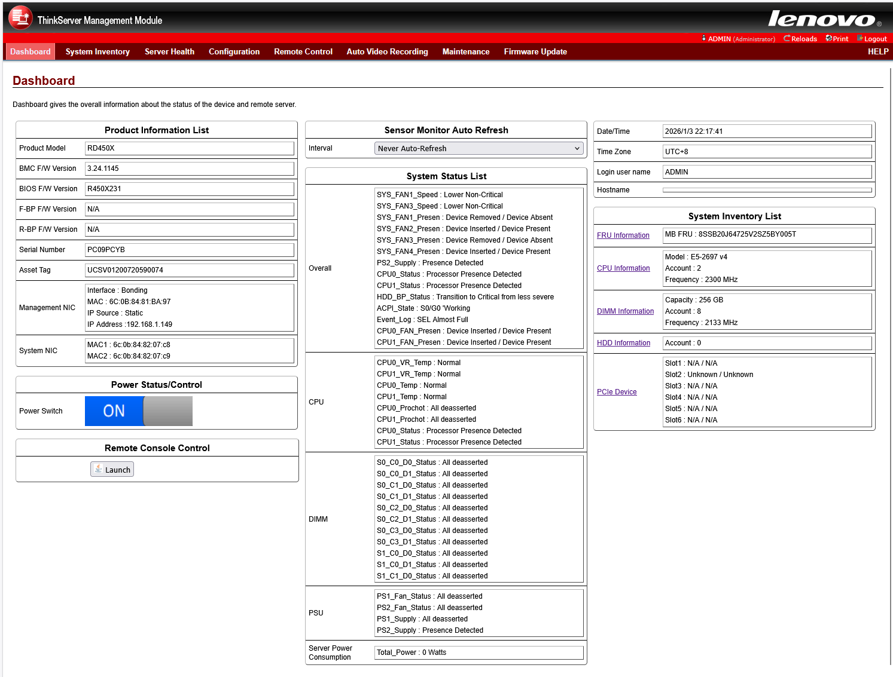

import CodeBlock from "@theme/CodeBlock";
import UnderConstructionWarning from "/docs/wiki/_snippets/under-construction-warning.mdx";
import partitiontable from "!!raw-loader!./partitions-table.json";

# BMC_RD450X_MLK_Baidu_V3.24.1145_SVT

```
/*******************************************************************************
* Release Information
* Project: Lenovo-RD450X-MLK-Baidu
* Version: 3.24.1145
* Date: 2016-12-19
********************************************************************************/
```

Features:

- картинка работает
- прошивка BIOS работает
- управление питанием работает

<details>
  <summary>Screenshot</summary>



</details>

## Проблемы и их решение

### Белый экран в хроме

Открой фаерфоксом

### Какой логин/пасс?

По умолчанию `ADMIN:ADMIN` (именно капсом)

### Не могу получить картинку через джаву

Полный мануал что и как можно [посмотреть тут](/docs/wiki/hardware/modding-and-hacks/megarac-sp/java-console/index.md)

### Если вставляю в dedicated порт кабель, то bmc не стартует

Скорее всего физически умер порт даже если радостно мигает светодиодами. Используйте только shared порт или из системы через `ipmi_si`.

### BMC умер совсем и никак не получается достучаться до него

Прошить bmc можно либо прищепкой, либо сервисной утилитой [ASPEED iRMP SOC Flash](/docs/wiki/hardware/tools/ASPEED-iRMP-SOC-Flash-Utility/index.mdx).

:::warning Бэкапьте перед прошивкой
:::

## Dumps

[Download BMC_RD450X_MLK_Baidu_V3.24.1145_SVT.tar.gz](@storageBaseUrl@/Lenovo-RD450x/BMC/BMC_RD450X_MLK_Baidu_V3.24.1145_SVT.tar.gz)

## Получение рутового шелла

Способ был проверен на этой версии, но уверен что и с другими поедет!

Скачиваем [config_sh.bak](./config_sh.bak), заливаем его через `Maintenance` => `Backup/Restore Configuration`, идём по ssh на bmc и вуаля.

```console
$ ssh -oHostKeyAlgorithms=+ssh-dss sysadmin@192.168.1.212
sysadmin@192.168.1.149's password: superuser
Executing [-/bin/sh]


BusyBox v1.13.2 (2016-12-19 15:55:17 CST) built-in shell (ash)
Enter 'help' for a list of built-in commands.

# uname -a
Linux  2.6.28.10-ami #1 Mon Dec 19 15:59:10 CST 2016 armv5tejl unknown
```

Подробнее о том как это работает: [bak2shell](/docs/wiki/hardware/modding-and-hacks/megarac-sp/bak2shell%20hack/index.mdx).

## Manual fan control

Для вертушек смотрите блок **3.3 Set Fan Configuration Command** in [Lenovo BMC Command List V0.1.1](@storageBaseUrl@/Lenovo-RD450x/docs/Lenovo-BMC-Command-List_V0.1.1.pdf)

Общий концепт такой:

```csharp title="ManualFanControl.cs"
public enum LenovoIpmiFanType
{
    ALL = 0,
    SYS_FAN1 = 1,
    SYS_FAN2 = 2,
    SYS_FAN3 = 3,
    SYS_FAN4 = 4,
    CPU_FAN1 = 5,
    CPU_FAN2 = 6,
}

public async Task SetFanSpeedAsync(LenovoIpmiFanType fan, int percentage)
{
    if (percentage > 100)
        percentage = 100;

    if (percentage < 0)
        percentage = 100;

    new ProcessStartInfo()
    {
        FileName = _options.IpmiToolFile ?? "ipmitool",
        Arguments = $"{_options.AccessArgs} raw 0x2e 0x30 00 {(int)fan} {percentage}",
        RedirectStandardError = true,
        RedirectStandardOutput = true,
        RedirectStandardInput = false,
    }
}
```

## Networking

| ipmi channel | purpose | mac label | UBoot IF |
| ------- | ------- | --------- | -------- |
| 1       | shared     | верхняя наклейка `IPMI: XX:XX:XX:XX:XX:XX` | ethaddr  |
| 8       | dedicated  | нижняя наклейка  `IPMI: XX:XX:XX:XX:XX:XX` | eth1addr |

### MAC repair

После прошивки не из web ui нужно восстановить MAC'и. На данный момент получилось это сделать простым способом [через ipmitools (вариант с 1 MAC'ом)](/docs/wiki/hardware/modding-and-hacks/megarac-sp/mac-recovery/index.mdx#a-самый-простой-через-ipmitools-вариант-с-1-macом) и более муторным [с изменением UBoot env (все MAC'и)](/docs/wiki/hardware/modding-and-hacks/megarac-sp/mac-recovery/index.mdx#c-напрямую-редактируем-uboot-env-все-macи).

## Разметка флеша

<details>
  <summary>`partitions table`</summary>
  <CodeBlock language="json" title="partitions-table.json">
    {partitiontable}
  </CodeBlock>
</details>
