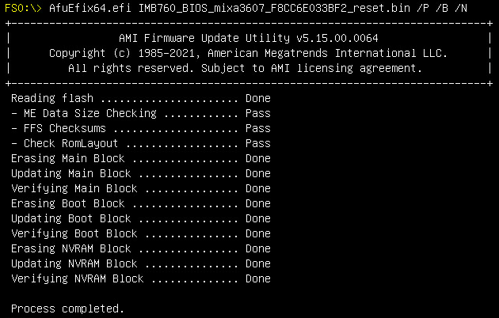

import DocCardList from "@theme/DocCardList";
import CodeBlock from "@theme/CodeBlock";
import Ch341aWarning from "/docs/wiki/hardware/_snippets/ch341a-warning.mdx";

# BIOS

BIOS на базе `AMI Aptio` и флеша `W25Q256JVFQ`

## Docs

- [Winbond W25Q256JV Datasheet](@storageBaseUrl@/Axiomtek-IMB760/docs/W25Q256JV-SPI-RevQ-02072025-Plus.pdf)
- [Axiomtek IMB760 User's Manual VA1_06-02-2022](@storageBaseUrl@/Axiomtek-IMB760/docs/IMB760-User-Manual-VA1_06-02-2022.pdf)
- [DEPO BIOS Manual](@storageBaseUrl@/Axiomtek-IMB760/docs/Manual_Depo_BIOS_DPC627-A.pdf)

## Прошивки

На данный момент известны 2 прошивки, но получить удалось только одну + 1 мод

- [Axiomtek AMI Aptio `IMB760 V1.00 / 5.21`](./AMI_Aptio_V1.00_5.21/index.mdx)
- DEPO AMI Aptio `1.0`

Известно 2 варианта зашиться/снять дамп:

- Хардверно прищепкой (можно не выпаивать)
- Софтверно [AMI ROM Tool - AfuEfi](../../../tools/index.mdx#ami-rom-tool) 

<Ch341aWarning />

<DocCardList />
