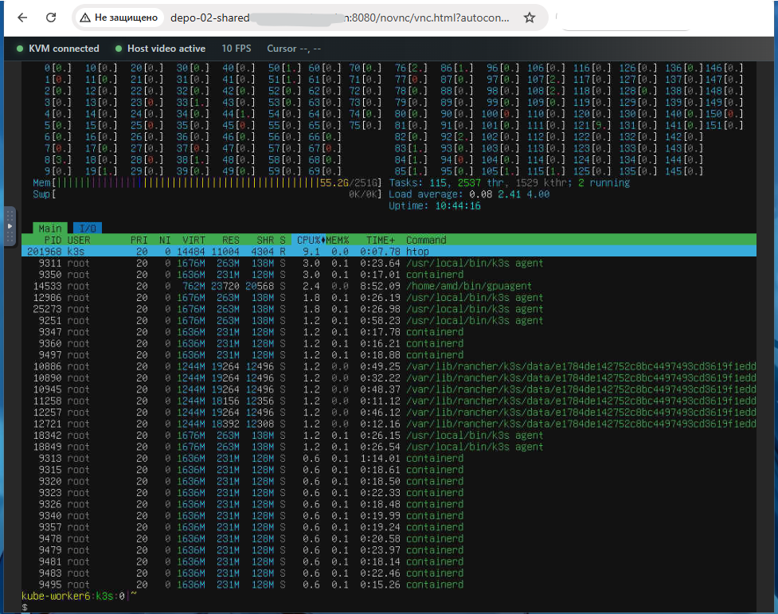

import FileInfo from "@site/src/components/FileInfo";
import Ch341aWarning from "/docs/wiki/hardware/_snippets/ch341a-warning.mdx";

# Axiomtek AMI Megarac SP MOD N1

Мод BMC на базе стокового Axiomtek AMI Megarac SP 2.02.76714.

```ini
FW_VERSION=2.02.76714
FW_DATE=Aug 8 2022
FW_BUILDTIME=MOD N1 VER03
FW_DESC=RR10 AST2500 MOD N1 VER 03
FW_PRODUCTID=1
FW_RELEASEID=RR9
FW_CODEBASEVERSION=3.X
```

## Changes

- MAC изменён на `de:ad:be:ef:ee:ef`
- Встроен хак [с рутовым шеллом на ssh](../Megarac_SP_2.02.76714/index.mdx#root-shell) (`sysadmin:superuser`)
- Native browser KVM на `:8080/novnc` (Basic Auth `admin:admin`)

<div style={{ maxWidth: "15rem", justifySelf: "center" }}>
  
</div>

## Downloads

<FileInfo
  name="IMB760_BMC_mixa3607_mod-N1_v03.bin"
  downloadUrl="https://github.com/mixa3607/ami-patching-infra/releases/tag/N1_v03"
  sha256hash="9a59a646fbdb8d412fa031a6f168a5c988ff970848d86d53ee24d366e6e1d239"
></FileInfo>

## Установка

Есть 2 способа, перед началом обязательно сделайте резервную копию текущей прошивки.

### Софтверно

Машина с BMC должна быть запущена и доступна по сети. Скачиваем [ASPEED iRMP SOC Flash](/docs/wiki/hardware/tools/ASPEED-iRMP-SOC-Flash-Utility/index.mdx) и зашиваем:

```console
$ ./socflash.sh of=backup.bin      # сначала бэкап текущей прошивки
$ ./socflash.sh if=IMB760_BMC_mixa3607_mod-N1_v03.bin
```

### Аппаратно

Прищепкой CH341A к флешке `W25Q256JVFQ`, предварительно сняв бэкап.

<Ch341aWarning />

После прошивки MAC меняется на `de:ad:be:ef:ee:ef`, поэтому BMC получит новый IP по DHCP — ищите его по новому MAC.

Логин по умолчанию: web `admin:admin`, ssh `sysadmin:superuser`.
