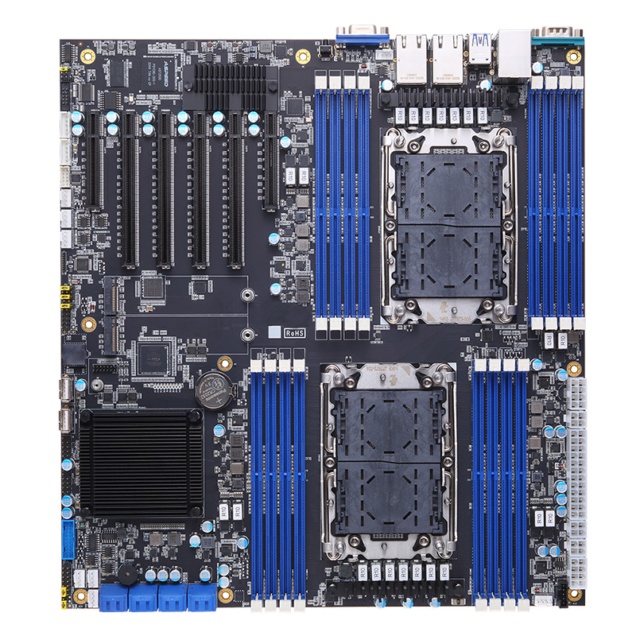

import CodeBlock from "@theme/CodeBlock";
import DocCardList from "@theme/DocCardList";
import TableWrapper from "@site/src/components/TableWrapper.tsx";
import biosdecode from "!!raw-loader!./biosdecode.txt";
import dmidecode from "!!raw-loader!./dmidecode.txt";
import sensors from "!!raw-loader!./sensors.txt";

# Axiomtek IMB760

Dual LGA4189 motherboard

На самом деле речь не о ней напрямую, но о [Плата системная DPC627A, ДАЦН.469535.031](https://gisp.gov.ru/goods/#/product/3700848) что по факту и есть тот самый аксиомтек. Даже на заставке биоса написано `IMB760`. **У DEPO есть нормальные BMC и BIOS, но они их не дают всяким проходимцам**.



:::warning Не рабочая сеть BMC
Есть личная неутешительная статистика что у 2х из 3х плат были слетевшие MAC'и которые пришлось восстанавливать. Подробнее в [Megarac SP 2.02.76714 => MAC repair](./BMC/Megarac_SP_2.02.76714/index.mdx#mac-repair). Но есть и хорошая новость - все платы удалось починить
:::

## Docs

- [Axiomtek Release info](@storageBaseUrl@/Axiomtek-IMB760/docs/IMB760-Review_07-03-2024.pdf)
- [Axiomtek IMB760 User's Manual VA1_06-02-2022](@storageBaseUrl@/Axiomtek-IMB760/docs/IMB760-User-Manual-VA1_06-02-2022.pdf)
- [DEPO BMC Manual](@storageBaseUrl@/Axiomtek-IMB760/docs/Manual_Depo_BMC_DPC627-A.pdf)
- [DEPO BIOS Manual](@storageBaseUrl@/Axiomtek-IMB760/docs/Manual_Depo_BIOS_DPC627-A.pdf)

## Specs

- [BMC AST2500](./BMC/index.mdx)
- [AMI Aptio BIOS](./BIOS/index.mdx)
- mosfets 7x MP86956 delivers 70A per socket ([source](https://forum.ixbt.com/topic.cgi?id=9:70249:141#141))
- all es 4-6 stepping cpus works
- only 24 pin + 2x cpu 8 pin is required, all other is optional
- LRDIMM и RDIMM - работают, UDIMM - не работают

## PCIe slots mapping

<TableWrapper>

| PCB label | socket   | slot len | IOU   |
| --------- | -------- | -------- | ----- |
| slot 2    | Socket 2 | x8       | IOU 1 |
| slot 3    | Socket 2 | x16      | IOU 0 |
| slot 4    | Socket 1 | x16      | IOU 0 |
| slot 5    | Socket 1 | x16      | IOU 1 |
| slot 6    | Socket 1 | x16      | IOU 3 |
| slot 7    | Socket 2 | x8       | IOU 1 |

</TableWrapper>

<details>
  <summary>`$ biosdecode`</summary>
  <CodeBlock>{biosdecode}</CodeBlock>
</details>

<details>
  <summary>`$ dmidecode`</summary>
  <CodeBlock>{dmidecode}</CodeBlock>
</details>

## Проблемы и их решения (?)

- Q: Винтики для М2 больше стандартных?
  - A: Да, используются M3 (5mm+-)
- Q: Тесты подсистемы памяти в AIDA64 показывают какие то странные цифры
  - A: Бывает, используйте [intel mlc](/docs/wiki/hardware/tools/index.mdx#intel-mlc)
- Q: В мод биосе есть разблокированный пункт с типом RAM RDIMM/UDIMM. Он работает?
  - A: Плату с UDIMM завести не удалось, шуршит вентиляторами, старта нет
- Q: В мануале ничего нет про LRDIMM. Они работают?
  - A: Да, есть старт с 8x Samsung 32G 2133 LRDIMM
- ...прочие проблемы специфичны для BIOS/BMC

## Sensors

### All sensors

<details>
  <summary>`$ sensors`</summary>
  <CodeBlock>{sensors}</CodeBlock>
</details>

### Sesors matching

```console title="/etc/sensors.d/imb760.conf"
bus "i2c-0" "SMBus I801 adapter at 0780"

chip "nct7802-i2c-0-28"
label fan1 "FAN1"
label fan2 "FAN2"
label fan3 "FAN3"

chip "nct7802-i2c-0-2f"
label fan1 "FAN4"
label fan2 "FAN5"
label fan3 "FAN6"

chip "f81768d-isa-0a20"
label fan1 "FAN-CPU1"
label fan2 "FAN-CPU2"
ignore fan3
```

### BMC sensors

То, что видит сам BMC из прошивки [Depo OpenBMC 1.0.1](./BMC/OpenBMC_mod_f1/index.mdx). Топология датчиков описывается конфигами entity-manager (`/usr/share/entity-manager/configurations/dpc627-a-system.json`), значения читаются из sysfs hwmon (драйверы ядра `nct7802`, `aspeed-pwm-tacho`) демонами `hwmontempsensor` (температуры) и `fansensor` (вентиляторы) из пакета `dbus-sensors`, и экспортируются в D-Bus на `/xyz/openbmc_project/sensors/{temperature,fan_tach,fan_pwm}/*`.

В саму логику и Web UI датчики не выведены, но в ОС BMC видны.

#### Temperature

<TableWrapper>

| D-Bus sensor  | I2C addr | hwmon        | attr         | Ед. | Назначение   |
| ------------- | -------- | ------------ | ------------ | --- | ------------ |
| Outlet2 Temp  | 0x28     | `nct7802`    | `temp1_input`| °C  | выход (верх) |
| PCH Temp      | 0x28     | `nct7802`    | `temp2_input`| °C  | PCH          |
| MB Temp       | 0x28     | `nct7802`    | `temp3_input`| °C  | плата        |
| Outlet1 Temp  | 0x28     | `nct7802`    | `temp4_input`| °C  | выход (низ)  |
| Inlet2 Temp   | 0x2f     | `nct7802`    | `temp1_input`| °C  | вход (верх)  |
| M.2 Temp      | 0x2f     | `nct7802`    | `temp2_input`| °C  | M.2          |
| Eth Temp      | 0x2f     | `nct7802`    | `temp3_input`| °C  | сеть         |
| Inlet1 Temp   | 0x2f     | `nct7802`    | `temp4_input`| °C  | вход (низ)   |

</TableWrapper>

Оба чипа `Nuvoton NCT7802` на шине `i2c0`, каждый по 4 канала терморезисторов (в DT `channel@0..3`, `temperature-mode = "thermistor"`). В хостовой ОС это те же `nct7802-i2c-0-28` / `nct7802-i2c-0-2f` из `$ sensors`.

#### Fans

<TableWrapper>

| D-Bus sensor | I2C addr | hwmon                  | attr               | Ед. | Назначение   |
| ------------ | -------- | ---------------------- | ------------------ | --- | ------------ |
| FAN1         | 0x28     | `nct7802`              | `fan1_input`       | RPM | корпус. 1    |
| FAN2         | 0x28     | `nct7802`              | `fan2_input`       | RPM | корпус. 2    |
| FAN3         | 0x28     | `nct7802`              | `fan3_input`       | RPM | корпус. 3    |
| FAN4         | 0x2f     | `nct7802`              | `fan1_input`       | RPM | корпус. 4    |
| FAN5         | 0x2f     | `nct7802`              | `fan2_input`       | RPM | корпус. 5    |
| FAN6         | 0x2f     | `nct7802`              | `fan3_input`       | RPM | корпус. 6    |
| CPU_FAN1     | —        | `aspeed_pwm_tacho`     | `fan1_input` (tach ch0) | RPM | CPU 1    |
| CPU_FAN2     | —        | `aspeed_pwm_tacho`     | `fan2_input` (tach ch1) | RPM | CPU 2    |
| CPU_FAN PWM  | —        | `aspeed_pwm_tacho`     | `pwm1..pwm2`       | %   | управление CPU_FAN1/2 |

</TableWrapper>

FAN1–FAN6 (`I2CFan`, index 0–2) — тахометры тех же двух NCT7802. CPU_FAN1/2 (`AspeedFan`) — встроенный в AST2500 PWM/TACH-контроллер (`pwm-tacho-controller@1e786000`, каналы tach 0 и 1), это не I2C. Отличие от хост ОС: там процессорные вертушки видны как `FAN-CPU1/FAN-CPU2` от Super I/O Fintek `F81768D` (`f81768d-isa-0a20`).

## Manual fan control

### Cpu fans

Если я правильно понимаю то настроить поведение вертушек на цпу можно только через меню в биосе (см. маунал)

### Sys fans

Системные вертушки можно легко крутить из системы. Всё достаточно стандартно

```bash
$ echo 1  | sudo tee /sys/class/hwmon/hwmonX/pwmY_enable  # enable FAN2 manual mode
$ echo 50 | sudo tee /sys/class/hwmon/hwmonX/pwmY         # set FAN2 to 50 (allowed 0-255)
```

### From BMC

[Read this](./BMC/Megarac_SP_2.02.76714/index.mdx#manual-fan-control)

<DocCardList />
