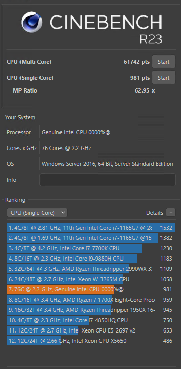
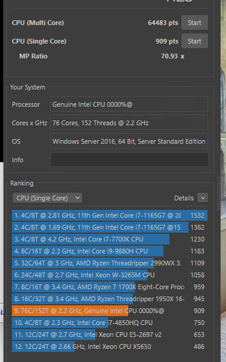

import Tabs from "@theme/Tabs";
import TabItem from "@theme/TabItem";
import CodeBlock from "@theme/CodeBlock";
import dmidecode from "!!raw-loader!./dmidecode.txt";
import lscpu from "!!raw-loader!./lscpu.txt";
import freqs from "!!raw-loader!./freqs.txt";

# QWAT

```
Sample name: QWAT
Release name: 8368
Stepping: 6
Average price: 900-1200Y
```

## Benchmarks

<Tabs>
  <TabItem value="freqs" label="max/min freqs" default>
    <CodeBlock>{freqs}</CodeBlock>
  </TabItem>
  <TabItem value="lscpu" label="$ lscpu">
    <CodeBlock>{lscpu}</CodeBlock>
  </TabItem>
  <TabItem value="dmidecode" label="$ dmidecode">
    <CodeBlock>{dmidecode}</CodeBlock>
  </TabItem>
</Tabs>

## Cinebench R23 (Dual setup)
<Tabs>
  <TabItem value="CinebenchR23-76" label="MT off" default>
    
  </TabItem>
  <TabItem value="CinebenchR23-152" label="MT on" default>
    
  </TabItem>
</Tabs>

## Overclocking 

Dual CPU + 16x16 HMA42GR7MFR4N-TF

```yaml title="Timings"
Frequency: 2666
Memory Voltage: 1200
Command Timing: 1N
Refresh Rate: 8800
CAS Latency: 18
tRP: 18
tRCD: 18
tRAS: 42
tWR: 24
tRFC: 450
tRRD: 4
tRRD_L: 6
tRTP: 10
tWTR: 10
tFAW: 16
tRC: 60
tCWL: 16
```

```text title="Intel MLC (windows)"
Measuring idle latencies for random access (in ns)...
                Numa node
Numa node            0       1
       0          97.2   146.6
       1         145.8    92.5

Measuring Peak Injection Memory Bandwidths for the system
Bandwidths are in MB/sec (1 MB/sec = 1,000,000 Bytes/sec)
Using all the threads from each core if Hyper-threading is enabled
Using traffic with the following read-write ratios
ALL Reads        :      301421.8
3:1 Reads-Writes :      260974.2
2:1 Reads-Writes :      245588.2
1:1 Reads-Writes :      243043.6
Stream-triad like:      266696.5

Measuring Memory Bandwidths between nodes within system
Bandwidths are in MB/sec (1 MB/sec = 1,000,000 Bytes/sec)
Using all the threads from each core if Hyper-threading is enabled
Using Read-only traffic type
                Numa node
Numa node              0               1
       0        151043.3         55754.6
       1         55701.3        150346.9
```
