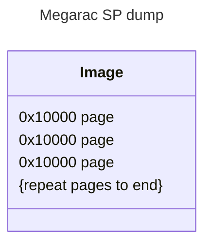
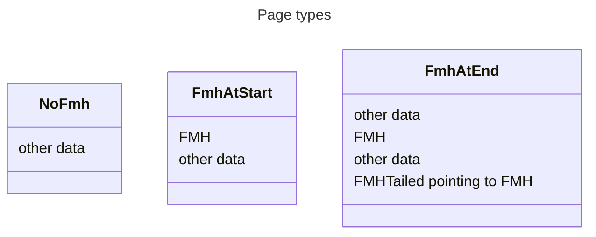
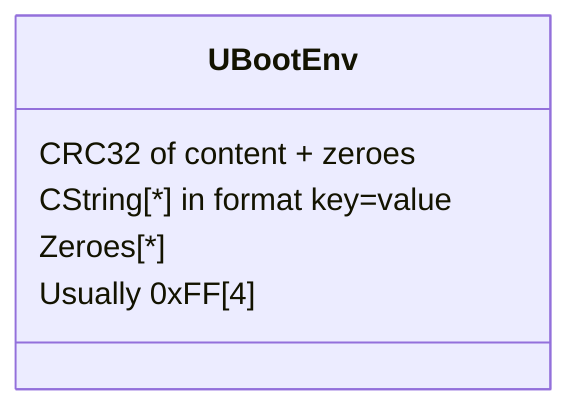

import UnderConstructionWarning from "/docs/wiki/_snippets/under-construction-warning.mdx";
import CodeBlock from "@theme/CodeBlock";
import DocCardList from "@theme/DocCardList";
import {useCurrentSidebarContainsName} from '@site/src/components/sidebarUtils.tsx';

# Deep dive into Megarac SP image

Разбираем дамп Megarac SP по кусочкам

<div style={{ maxWidth: "15rem", justifySelf: "center" }}>
  
</div>

<UnderConstructionWarning />

Проверено на megarac с такими код бейзами:

```
FW_VERSION=2.02.76714
FW_DATE=Aug 8 2022
FW_DESC=RR10 AST2500 KERN3 BUILD 2
FW_RELEASEID=RR9
FW_CODEBASEVERSION=3.X
```

```
FW_VERSION=3.24.4421
FW_DATE=Dec 19 2016
FW_DESC=RR8 AST2400 HWENC BUILD 2
```

## Theory

Весь дамп состоит из страниц (`erasesize`) по `0x10000`. Может есть и другой, но не было замечено на практике, точно можно определить размер посмотрев в `/sys/class/mtd/mtdX/erasesize`, но об этом будет позже.



### FMH

Каждая страница может содержать в начале или в конце FMH структуру. Если FMH в конце aka FMHTailed, то это указатель на полноценный FMH который можнт быть уже в любом месте страницы кроме старта. FMH содержит всю информацию по модулю (начало, размер, тип).



Разобрав эти структуры можно в общем уже разобрать дамп на partiotions, но без внутренних деталей. Обычно этого уже достаточно и даёт НА МНОГО более релевантные данные в отличие от `binwalk` который к примеру склеивает последовательные `jffs` в один.

### Flashing sectors

Для более глубокого понимания что, как и куда монтируется нужна уже рабочая борда с доступом к `sh`.

Инфомацию можно собрать из:

- `dmesg` - разметка (дублирует в большей части данные из FMH)
- `/sys/class/mtd/mtd*/erasesize` - узнать `erasesize`
- `/proc/sys/ractrends/Helper/*` - узнать адрес где лежат `uboot env`

#### `dmesg`

В `dmesg` ядра лежит разметка флешки на блоки и обычно дублирует то что можно и так достать из FMH

#### `/proc/sys/ractrends/Helper/*`

Это то чем руководствуется флешер что бы не стереть ифнормацию по типу MAC адресов при обновлении прошивки BMC

- `/proc/sys/ractrends/Helper/FlashSize` - полный размер флеша
- `/proc/sys/ractrends/Helper/FlashStart` - место в памяти с которого начинается флешка. То есть реальный `0x10` адрес флешки будет виден как `FlashStart + 0x10`
- `/proc/sys/ractrends/Helper/FlashSectorSize` - тот самый размер страницы который было бы не плохо знать на этапе парсинга FMH, но он как правило `65536`(`0x10000`)
- `/proc/sys/ractrends/Helper/EnvStart` - адрес в памяти начала UBoot env vars
- `/proc/sys/ractrends/Helper/EnvSize` - размер UBoot env vars (как правило одна страница флеша)

## Practice

Пришло время на практике раздербанить дамп на кусочки. Повсеместно будет использован самописный комбайн [uefi-mod-tools](/docs/wiki/hardware/tools/index#uefi-mod-tools). Все операции производятся в linux.

По ходу дела наша задача собрать `partitions.json` в формате:

```json title="partitions.json"
{
  "partitions": [
    {
      "fileName": "section.bin",    <- extract to file
      "beginAddress": "0x00000000", <- begin
      "endAddress": "0x00040000",   <- end
      ... any other props will be ignored
    }
    ... other partitions
  ]
}
```

### Снимаем дамп

Дамп можно снять прищёпкой, софтверно через lxflash (ASPEED iRMP SOC Flash), как то софтверно через `flasher` из sh BMC (на практике не делалось).

<DocCardList items={useCurrentSidebarContainsName("ASPEED-iRMP-SOC-Flash-Utility")} />

```console title="server host OS"
$ sudo ./socflash.sh of=backup_rd450x_pve2_04-01-26.bin
ASPEED SOC Flash Utility v.1.20.00
Warning:
SoCflash utility is only for engineers to update the firmware in lab,
it is not a commercialized software product,
ASPEED has not done compatibility/reliability stress test for SoCflash.
Please do not use this utility for any mass production purpose.
Press y to continue if you are agree ....
y
Find ASPEED Device 1a03:2000 on 5:0.0
MMIO Virtual Address: c9dd1000
Relocate IO Base: 5000
Found ASPEED Device 1a03:2400 rev. 30
Static Memory Controller Information:
CS0 Flash Type is SPI
CS1 Flash Type is SPI
CS2 Flash Type is NOR
CS3 Flash Type is NOR
CS4 Flash Type is NOR
Boot CS is 0
Option Information:
CS: 0
Flash Type: SPI
[Warning] Don't AC OFF or Reboot System During BMC Firmware Update!!
[SOCFLASH] Flash ID : 1920c2
Find Flash Chip #1: MXIC MX25L256/257
Backup Flash Chip O.K.
```

### Сканим FMH

```console
$ uefi-mod-tools ami bmc-fmh-scan -i backup_rd450x_pve2_04-01-26.bin
[23:09:54 INF] Reading data from backup_rd450x_pve2_04-01-26.bin
[23:09:54 INF] Found FMH tail in 0x0000FFF0-0x00010000 that pointing to 0x0000FF80
[23:09:54 INF] Found FMH in 0x0000FF80-0x0000FFC0 that pointing to module boot 0x00000000-0x0002F198
[23:09:54 INF] Found FMH in 0x00040000-0x00040040 that pointing to module conf 0x00050000-0x000C0000
[23:09:54 INF] Found FMH in 0x000C0000-0x000C0040 that pointing to module conf 0x000D0000-0x00140000
[23:09:54 INF] Found FMH in 0x00140000-0x00140040 that pointing to module root 0x00150000-0x01252040
[23:09:54 INF] Found FMH in 0x01260000-0x01260040 that pointing to module osimage 0x01260040-0x0143A02C
[23:09:54 INF] Found FMH in 0x01440000-0x01440040 that pointing to module www 0x01450000-0x01670000
[23:09:54 INF] Found FMH in 0x01FF0000-0x01FF0040 that pointing to module ast2400e 0x01FF0040-0x01FF00B4
[23:09:54 INF] Writing output to console
[
  {
    "Type": "FMH-end",
    "beginAddress": "0x0000FFF0",
    "endAddress": "0x00010000",
    "pointingToAddress": "0x0000FF80"
  },
  {
    "Type": "FMH",
    "beginAddress": "0x0000FF80",
    "endAddress": "0x0000FFC0",
    "moduleBeginAddress": "0x00000000",
    "moduleEndAddress": "0x0002F198",
    "moduleName": "boot"
  },
  {
    "Type": "FMH",
    "beginAddress": "0x00040000",
    "endAddress": "0x00040040",
    "moduleBeginAddress": "0x00050000",
    "moduleEndAddress": "0x000C0000",
    "moduleName": "conf"
  },
  {
    "Type": "FMH",
    "beginAddress": "0x000C0000",
    "endAddress": "0x000C0040",
    "moduleBeginAddress": "0x000D0000",
    "moduleEndAddress": "0x00140000",
    "moduleName": "conf"
  },
  {
    "Type": "FMH",
    "beginAddress": "0x00140000",
    "endAddress": "0x00140040",
    "moduleBeginAddress": "0x00150000",
    "moduleEndAddress": "0x01252040",
    "moduleName": "root"
  },
  {
    "Type": "FMH",
    "beginAddress": "0x01260000",
    "endAddress": "0x01260040",
    "moduleBeginAddress": "0x01260040",
    "moduleEndAddress": "0x0143A02C",
    "moduleName": "osimage"
  },
  {
    "Type": "FMH",
    "beginAddress": "0x01440000",
    "endAddress": "0x01440040",
    "moduleBeginAddress": "0x01450000",
    "moduleEndAddress": "0x01670000",
    "moduleName": "www"
  },
  {
    "Type": "FMH",
    "beginAddress": "0x01FF0000",
    "endAddress": "0x01FF0040",
    "moduleBeginAddress": "0x01FF0040",
    "moduleEndAddress": "0x01FF00B4",
    "moduleName": "ast2400e"
  }
]
```

И перевариваем в `partitions.json`

```json title="partitions.json"
{
  "partitions": [
    {
      "fileName": "10-boot.bin",
      "beginAddress": "0x00000000",
      "endAddress": "0x0002F198"
    },
    {
      "fileName": "20-conf.bin",
      "beginAddress": "0x00050000",
      "endAddress": "0x000C0000"
    },
    {
      "fileName": "30-conf.bin",
      "beginAddress": "0x000D0000",
      "endAddress": "0x00140000"
    },
    {
      "fileName": "40-root.bin",
      "beginAddress": "0x00150000",
      "endAddress": "0x01252040"
    },
    {
      "fileName": "40-osimage.bin",
      "beginAddress": "0x01260040",
      "endAddress": "0x0143A02C"
    },
    {
      "fileName": "50-www.bin",
      "beginAddress": "0x01450000",
      "endAddress": "0x01670000"
    },
    {
      "fileName": "60-ast2400e.bin",
      "beginAddress": "0x01FF0040",
      "endAddress": "0x01FF00B4"
    }
  ]
}
```

### Обогащение данными из sh

Идём по ssh в BMC и достаём оттуда больше данных. Как получить рутовый шелл: [bak2shell](/docs/wiki/hardware/modding-and-hacks/megarac-sp/bak2shell%20hack/index.mdx).

```console title="Чекаем что разметка из пункта выше сходится (BMC sh)"
$ dmesg
....
<4>*PartCount is 0
<4>MTD Partition 0 : fullpart @ 0x0 of Size 0x2000000
<4>MTD Partition 1 : conf @ 0x50000 of Size 0x70000
<4>MTD Partition 2 : conf @ 0xd0000 of Size 0x70000
<4>MTD Partition 3 : root @ 0x150000 of Size 0x1110000
<4>MTD Partition 4 : www @ 0x1450000 of Size 0x220000
<5>Creating 5 MTD partitions on "Ractrends":
<5>0x00000000-0x02000000 : "fullpart"
<5>0x00050000-0x000c0000 : "conf"
<5>0x000d0000-0x00140000 : "conf"
<5>0x00150000-0x01260000 : "root"
<5>0x01450000-0x01670000 : "www"
```

В общем и целом всё ок не считая выравнивания по странице, FMH в приоритете

```console title="Смотрим маунты (BMC sh)"
# cat /proc/cmdline
root=/dev/ramdisk ro ip=none ramdisk_blocksize=4096 mem=210M console=ttyS4,38400 rootfstype=cramfs bigphysarea=6144 imagebooted=1
$ mount
rootfs on / type rootfs (rw)
/dev/root on / type cramfs (ro)
/dev/proc on /proc type proc (rw)
sys on /sys type sysfs (rw)
/dev/shm on /var type tmpfs (rw)
devpts on /dev/pts type devpts (rw,gid=5,mode=620)
/dev/mtdblock1 on /conf type jffs2 (rw)
/dev/mtdblock2 on /bkupconf type jffs2 (rw)
/dev/mtdblock4 on /usr/local/www type cramfs (ro)
```

:::note
В некоторых версиях `/` маунтится как `/dev/ramdisk`, но по факту это `0x00150000-0x01260000 : "root"`
:::

Собирая всё что выше воедино получается:
| range | mtd | name | mount |
|-----|-----|-----| -----|
| `0x00150000-0x01260000` | mtdblock3 | root | `/` |
| `0x00050000-0x000c0000` | mtdblock1 | conf | `/conf` |
| `0x000d0000-0x00140000` | mtdblock2 | conf | `/bkupconf` |
| `0x01450000-0x01670000` | mtdblock4 | conf | `/usr/local/www` |

```console title="Инфо о UBoot env (BMC sh)"
$ # Base addr
$ echo $(( ($(cat /proc/sys/ractrends/Helper/EnvStart) - $(cat /proc/sys/ractrends/Helper/FlashStart)) ))
196608
# Len
$ cat /proc/sys/ractrends/Helper/EnvSize
65536
```
Итого `0x30000-0x40000`

<details>
  <summary>Альтернативный способ найти UBoot env</summary>


Способ не 100%, но если вендор не стал придумывать каких то маразм схем, то подойдёт вариант с последовательным сканом всех страниц и проверкой CRC32, если совпало, то совпало :/
```console
$ uefi-mod-tools uboot env-scan -i backup_rd450x_pve2_04-01-26.bin -o -
[00:12:57 INF] Reading data from backup_rd450x_pve2_04-01-26.bin
[00:12:57 INF] CRC32 hash matched
[00:12:57 INF] Read 15 pairs
[00:12:57 INF] Found potential env section in page 0x00030000-0x00040000
[00:12:57 INF] Writing output to console
{
  "foundEnvPages": [
    {
      "variables": {
        "bootcmd": "bootfmh",
        "bootdelay": "3",
        "baudrate": "0x9600",
        "loads_echo": "1",
        "autoload": "no",
        "bootselector": "1",
        "recentlyprogfw": "1",
        "do_memtest": "0",
        "memtest_pass": "idle",
        "stdin": "serial",
        "stdout": "serial",
        "stderr": "serial",
        "ethact": "ast_eth0",
        "ethaddr": "6c:0b:84:81:ba:97",
        "eth1addr": "6c:0b:84:81:ba:98"
      },
      "beginAddress": "0x00030000",
      "endAddress": "0x00040000"
    }
  ]
}
```
</details>

### Сводим в файлик
```json title="partitions.json"
{
  "partitions": [
    {
      // uboot
      "fileName": "10-boot.bin",
      "beginAddress": "0x00000000",
      "endAddress": "0x0002F198"
    },
    {
      // uboot env
      "fileName": "11-boot-env.bin",
      "beginAddress": "0x00030000",
      "endAddress": "0x00040000",
    },
    {
      // mount as '/conf' (jffs2)
      "fileName": "20-conf.bin",
      "beginAddress": "0x00050000",
      "endAddress": "0x000C0000"
    },
    {
      // mount as '/bkupconf' (jffs2)
      "fileName": "30-conf.bin",
      "beginAddress": "0x000D0000",
      "endAddress": "0x00140000"
    },
    {
      // mount as '/' (uimage ramdisk)
      "fileName": "40-root-header.bin",
      "beginAddress": "0x00150000",
      "endAddress": "0x01252040"
    },
    // Откуда инфо что это uimage header + cramfs? Это заметка от меня из будущего который уже посмотрел внутрь через binwalk
    {
      // mount as '/' (uimage header)
      "fileName": "41-root-header.bin",
      "beginAddress": "0x00150000",
      "endAddress": "0x00150040"
    },
    {
      // mount as '/' (uimage content (cramfs))
      "fileName": "42-root-content.bin",
      "beginAddress": "0x00150040",
      "endAddress": "0x01252040"
    },
    {
      // kernel (uimage)
      "fileName": "50-osimage.bin",
      "beginAddress": "0x01260040",
      "endAddress": "0x0143A02C"
    },
    {
      // mount as '/usr/local/www' (cramfs)
      "fileName": "60-www.bin",
      "beginAddress": "0x01450000",
      "endAddress": "0x01670000"
    },
    {
      // build info (string)
      "fileName": "70-ast2400e.bin",
      "beginAddress": "0x01FF0040",
      "endAddress": "0x01FF00B4"
    }
  ]
}
```

### Разбираем бинарь
```console title="split"
$ uefi-mod-tools bin split -i backup_rd450x_pve2_04-01-26.bin -t partitions.json -o backup_rd450x_pve2_04-01-26
[01:46:15 INF] Reading data from backup_rd450x_pve2_04-01-26.bin
[01:46:15 INF] Reading data from partitions.json
[01:46:15 INF] Saving backup_rd450x_pve2_04-01-26/10-boot.bin
[01:46:15 INF] Writing output to backup_rd450x_pve2_04-01-26/10-boot.bin
[01:46:15 INF] Saving backup_rd450x_pve2_04-01-26/11-boot-env.bin
[01:46:15 INF] Writing output to backup_rd450x_pve2_04-01-26/11-boot-env.bin
[01:46:15 INF] Saving backup_rd450x_pve2_04-01-26/20-conf.bin
[01:46:15 INF] Writing output to backup_rd450x_pve2_04-01-26/20-conf.bin
[01:46:15 INF] Saving backup_rd450x_pve2_04-01-26/30-conf.bin
[01:46:15 INF] Writing output to backup_rd450x_pve2_04-01-26/30-conf.bin
[01:46:15 INF] Saving backup_rd450x_pve2_04-01-26/40-root-header.bin
[01:46:15 INF] Writing output to backup_rd450x_pve2_04-01-26/40-root-header.bin
[01:46:15 INF] Saving backup_rd450x_pve2_04-01-26/41-root-header.bin
[01:46:15 INF] Writing output to backup_rd450x_pve2_04-01-26/41-root-header.bin
[01:46:15 INF] Saving backup_rd450x_pve2_04-01-26/42-root-content.bin
[01:46:15 INF] Writing output to backup_rd450x_pve2_04-01-26/42-root-content.bin
[01:46:15 INF] Saving backup_rd450x_pve2_04-01-26/50-osimage.bin
[01:46:15 INF] Writing output to backup_rd450x_pve2_04-01-26/50-osimage.bin
[01:46:15 INF] Saving backup_rd450x_pve2_04-01-26/60-www.bin
[01:46:15 INF] Writing output to backup_rd450x_pve2_04-01-26/60-www.bin
[01:46:15 INF] Saving backup_rd450x_pve2_04-01-26/70-ast2400e.bin
[01:46:15 INF] Writing output to backup_rd450x_pve2_04-01-26/70-ast2400e.bin
```

<details>
  <summary>`$ binwalk`</summary>
  
```console
$ find ./backup_rd450x_pve2_04-01-26/ -type f | sort |  xargs -n 1 binwalk

                              /home/mixa3607/rd450x/backup_rd450x_pve2_04-01-26/10-boot.bin
------------------------------------------------------------------------------------------------------------------------
DECIMAL                            HEXADECIMAL                        DESCRIPTION
------------------------------------------------------------------------------------------------------------------------
152300                             0x252EC                            CRC32 polynomial table, little endian
153604                             0x25804                            U-Boot version string: 1.1.6 (Nov 27 2018 -
                                                                      15:34:08)
190368                             0x2E7A0                            CRC32 polynomial table, little endian
------------------------------------------------------------------------------------------------------------------------

Analyzed 1 file for 111 file signatures (251 magic patterns) in 3.0 milliseconds
Analyzed 1 file for 111 file signatures (251 magic patterns) in 2.0 milliseconds

                              /home/mixa3607/rd450x/backup_rd450x_pve2_04-01-26/20-conf.bin
------------------------------------------------------------------------------------------------------------------------
DECIMAL                            HEXADECIMAL                        DESCRIPTION
------------------------------------------------------------------------------------------------------------------------
320                                0x140                              JFFS2 filesystem, little endian, nodes: 792,
                                                                      total size: 440976 bytes
------------------------------------------------------------------------------------------------------------------------

Analyzed 1 file for 111 file signatures (251 magic patterns) in 3.0 milliseconds

                              /home/mixa3607/rd450x/backup_rd450x_pve2_04-01-26/30-conf.bin
------------------------------------------------------------------------------------------------------------------------
DECIMAL                            HEXADECIMAL                        DESCRIPTION
------------------------------------------------------------------------------------------------------------------------
0                                  0x0                                JFFS2 filesystem, little endian, nodes: 990,
                                                                      total size: 458704 bytes
------------------------------------------------------------------------------------------------------------------------

Analyzed 1 file for 111 file signatures (251 magic patterns) in 4.0 milliseconds

                          /home/mixa3607/rd450x/backup_rd450x_pve2_04-01-26/40-root-header.bin
------------------------------------------------------------------------------------------------------------------------
DECIMAL                            HEXADECIMAL                        DESCRIPTION
------------------------------------------------------------------------------------------------------------------------
0                                  0x0                                uImage firmware image, header size: 64 bytes,
                                                                      data size: 17833984 bytes, compression: none,
                                                                      CPU: ARM, OS: Linux, image type: RAMDisk Image,
                                                                      load address: 0x0, entry point: 0x0, creation
                                                                      time: 2016-12-19 08:06:55, image name: ""
------------------------------------------------------------------------------------------------------------------------

Analyzed 1 file for 111 file signatures (251 magic patterns) in 41.0 milliseconds
Analyzed 1 file for 111 file signatures (251 magic patterns) in 2.0 milliseconds

                          /home/mixa3607/rd450x/backup_rd450x_pve2_04-01-26/42-root-content.bin
------------------------------------------------------------------------------------------------------------------------
DECIMAL                            HEXADECIMAL                        DESCRIPTION
------------------------------------------------------------------------------------------------------------------------
0                                  0x0                                CramFS filesystem, little endian, 2560 files,
                                                                      total size: 17833984 bytes
------------------------------------------------------------------------------------------------------------------------

Analyzed 1 file for 111 file signatures (251 magic patterns) in 48.0 milliseconds

                            /home/mixa3607/rd450x/backup_rd450x_pve2_04-01-26/50-osimage.bin
------------------------------------------------------------------------------------------------------------------------
DECIMAL                            HEXADECIMAL                        DESCRIPTION
------------------------------------------------------------------------------------------------------------------------
0                                  0x0                                uImage firmware image, header size: 64 bytes,
                                                                      data size: 1941420 bytes, compression: none, CPU:
                                                                      ARM, OS: Linux, image type: OS Kernel Image, load
                                                                      address: 0x40008000, entry point: 0x40008000,
                                                                      creation time: 2016-12-19 07:59:14, image name:
                                                                      "Linux-2.6.28.10-ami"
------------------------------------------------------------------------------------------------------------------------

Analyzed 1 file for 111 file signatures (251 magic patterns) in 7.0 milliseconds

                              /home/mixa3607/rd450x/backup_rd450x_pve2_04-01-26/60-www.bin
------------------------------------------------------------------------------------------------------------------------
DECIMAL                            HEXADECIMAL                        DESCRIPTION
------------------------------------------------------------------------------------------------------------------------
0                                  0x0                                CramFS filesystem, little endian, 740 files,
                                                                      total size: 2191360 bytes
------------------------------------------------------------------------------------------------------------------------

Analyzed 1 file for 111 file signatures (251 magic patterns) in 7.0 milliseconds
Analyzed 1 file for 111 file signatures (251 magic patterns) in 2.0 milliseconds
```

</details>

### Экстрактим секции

:::note
Всегда обращайте внимание на endianes при упаковке
:::

#### UBoot 
Это экзешник, можно залить в IDA PRO и поковырять так же тут можно запатчить `cmdline` ядра

#### UBoot env
Это страница такой структуры



Разбираем:
```console title="in backup_rd450x_pve2_04-01-26"
$ uefi-mod-tools uboot env-read -i 11-boot-env.bin -o 11-boot-env.json
[00:25:47 INF] Reading data from 11-boot-env.bin
[00:25:47 INF] CRC32 hash matched
[00:25:47 INF] Read 15 pairs
[00:25:47 INF] Writing output to 11-boot-env.json
$ cat 11-boot-env.json
{
  "size": 65536,
  "paddingSize": 4,
  "hash": 879708050,
  "hashMatched": true,
  "variables": {
    "bootcmd": "bootfmh",
    "bootdelay": "3",
    "baudrate": "0x9600",
    "loads_echo": "1",
    "autoload": "no",
    "bootselector": "1",
    "recentlyprogfw": "1",
    "do_memtest": "0",
    "memtest_pass": "idle",
    "stdin": "serial",
    "stdout": "serial",
    "stderr": "serial",
    "ethact": "ast_eth0",
    "ethaddr": "6c:0b:84:81:ba:97",
    "eth1addr": "6c:0b:84:81:ba:98"
  }
}
```

Добавляем/меняем/удаляем переменные и собраем обратно:
```console title="in backup_rd450x_pve2_04-01-26"
$ uefi-mod-tools uboot env-write -i 11-boot-env.json -o 11-boot-env.bin
[00:29:22 INF] Reading data from 11-boot-env.json
[00:29:22 INF] Write 15 pairs
[00:29:22 INF] Writing output to 11-boot-env.bin
```

#### CramFS
Распаковка:
```console title="in backup_rd450x_pve2_04-01-26"
$ mkdir /mnt/cramfs
$ sudo mount -t cramfs -o rw 60-www.bin /mnt/cramfs
$ mkdir 60-www
$ cp -a /mnt/cramfs/. 60-www
$ sudo umount /mnt/cramfs
```

Упаковка (не проверено):
```console title="in backup_rd450x_pve2_04-01-26"
$ mkfs.cramfs -b 65536 -N little ./60-www ./60-www.bin
mkfs.cramfs: warning: gids truncated to 8 bits.  (This may be a security concern.)
```

#### JFFS2
Распаковка:
```console title="in backup_rd450x_pve2_04-01-26"
$ binwalk 30-conf.bin -d 30-conf -e

            /home/mixa3607/rd450x/backup_rd450x_pve2_04-01-26/30-conf/30-conf.bin
---------------------------------------------------------------------------------------------
DECIMAL                            HEXADECIMAL                        DESCRIPTION
---------------------------------------------------------------------------------------------
0                                  0x0                                JFFS2 filesystem,
                                                                      little endian, nodes:
                                                                      990, total size:
                                                                      458704 bytes
---------------------------------------------------------------------------------------------
[+] Extraction of jffs2 data at offset 0x0 completed successfully
---------------------------------------------------------------------------------------------

Analyzed 1 file for 111 file signatures (251 magic patterns) in 239.0 milliseconds
$ ls 30-conf/30-conf.bin.extracted/0/jffs2-root/
BMC.conf                 dhcp.preip_4      ntp.conf              snmpd.conf
BMC1                     dhcp6c.conf       ntp.stat              ssh_host_dsa_key
Dev_GUID.dat             dhcp6c_duid       openLdapGroup.conf    ssh_host_dsa_key.pub
Fwversion                dns.conf          pam_withunix          ssh_host_rsa_key
InstanceLocations.txt    dns.tmp           pam_wounix            ssh_host_rsa_key.pub
Preserve-AMI.ini         hostname          passwd                sshd_config
Sys_GUID.dat             hostname.conf     phycfg.conf           stunnel.conf
UpdateIptablesconf.sh    hosts             pwdEncKey             syslog.conf
activedir.conf           hosts.allow       radius.conf.disabled  timeouts
activeslave.conf         hosts.deny        radiuspriv.ini        uartroute_BMC.conf
adjtime                  hpm.conf          resolv.conf           uartroute_SOL.conf
adviserd.conf            interfaces        rmedia.conf           uartroute_SYS.conf
autorecord.conf          iptables.conf     rotate.conf           user_home
backup_cfg_list-AMI.ini  ldap.conf         rsyslog.conf          usermacro.conf
bond.conf                license           rt_tables             vlaninterfaces
compbook                 localtime         shadow                vlansetting.conf
console_tty              mountall_dual.sh  singleport.conf       vmedia.conf
crontab                  ncml.conf         snmp
dcmi.conf                ncsicfg.conf      snmp_users.conf
default_sh               nsswitch.conf     snmpcfg.conf
```

Упаковка (не проверено):
```console title="in backup_rd450x_pve2_04-01-26"
$ sudo mkfs.jffs2 -d 30-conf/30-conf.bin.extracted/0/jffs2-root/ -e 65536 -o 30-conf.mod.bin --little-endian -v
...
Compression mode: priority
Compressors:
      none             compr: 45 blocks (1344)  decompr: 0 blocks
       lzo (prio:80) - compr: 0 blocks (0/0)  decompr: 0 blocks
      zlib (prio:60) + compr: 300 blocks (83844/307813)  decompr: 0 blocks
     rtime (prio:50) + compr: 1 blocks (2/3)  decompr: 0 blocks
Compression errors: 0
```

#### build info (string)
Это просто строка с билд инфой
```console title="in backup_rd450x_pve2_04-01-26"
$ cat 70-ast2400e.bin
FW_VERSION=3.24.4421
FW_DATE=Dec 19 2016
FW_BUILDTIME=16:07:05 CST
FW_DESC=RR8 AST2400 HWENC BUILD 2
FW_PRODUCTID=1
```

### Собираем всё обратно

Перетираем партишены в родном дампе по очереди в которой они в `partitions.json`

```console
$ uefi-mod-tools bin combine -i backup_rd450x_pve2_04-01-26.bin -t partitions.json -p backup_rd450x_pve2_04-01-26 -o bac
kup_rd450x_pve2_04-01-26.mod.bin
[01:54:30 INF] Reading data from backup_rd450x_pve2_04-01-26.bin
[01:54:30 INF] Reading data from partitions.json
[01:54:30 INF] Injecting backup_rd450x_pve2_04-01-26/10-boot.bin
[01:54:30 INF] Reading data from backup_rd450x_pve2_04-01-26/10-boot.bin
[01:54:30 INF] Injecting backup_rd450x_pve2_04-01-26/11-boot-env.bin
[01:54:30 INF] Reading data from backup_rd450x_pve2_04-01-26/11-boot-env.bin
[01:54:30 INF] Injecting backup_rd450x_pve2_04-01-26/20-conf.bin
[01:54:30 INF] Reading data from backup_rd450x_pve2_04-01-26/20-conf.bin
[01:54:30 INF] Injecting backup_rd450x_pve2_04-01-26/30-conf.bin
[01:54:30 INF] Reading data from backup_rd450x_pve2_04-01-26/30-conf.bin
[01:54:30 INF] Injecting backup_rd450x_pve2_04-01-26/40-root-header.bin
[01:54:30 INF] Reading data from backup_rd450x_pve2_04-01-26/40-root-header.bin
[01:54:30 INF] Injecting backup_rd450x_pve2_04-01-26/41-root-header.bin
[01:54:30 INF] Reading data from backup_rd450x_pve2_04-01-26/41-root-header.bin
[01:54:30 INF] Injecting backup_rd450x_pve2_04-01-26/42-root-content.bin
[01:54:30 INF] Reading data from backup_rd450x_pve2_04-01-26/42-root-content.bin
[01:54:30 INF] Injecting backup_rd450x_pve2_04-01-26/50-osimage.bin
[01:54:30 INF] Reading data from backup_rd450x_pve2_04-01-26/50-osimage.bin
[01:54:30 INF] Injecting backup_rd450x_pve2_04-01-26/60-www.bin
[01:54:30 INF] Reading data from backup_rd450x_pve2_04-01-26/60-www.bin
[01:54:30 INF] Injecting backup_rd450x_pve2_04-01-26/70-ast2400e.bin
[01:54:30 INF] Reading data from backup_rd450x_pve2_04-01-26/70-ast2400e.bin
[01:54:30 INF] Saving backup_rd450x_pve2_04-01-26.mod.bin
[01:54:30 INF] Writing output to backup_rd450x_pve2_04-01-26.mod.bin
```

## Final words
Если вам повезёт и ничего не сломалось, то таким образом можно аккуратно поправить BMC прошивку, а если трогать только UBoot env для восстановления MACов, то шанс на успех 99%.