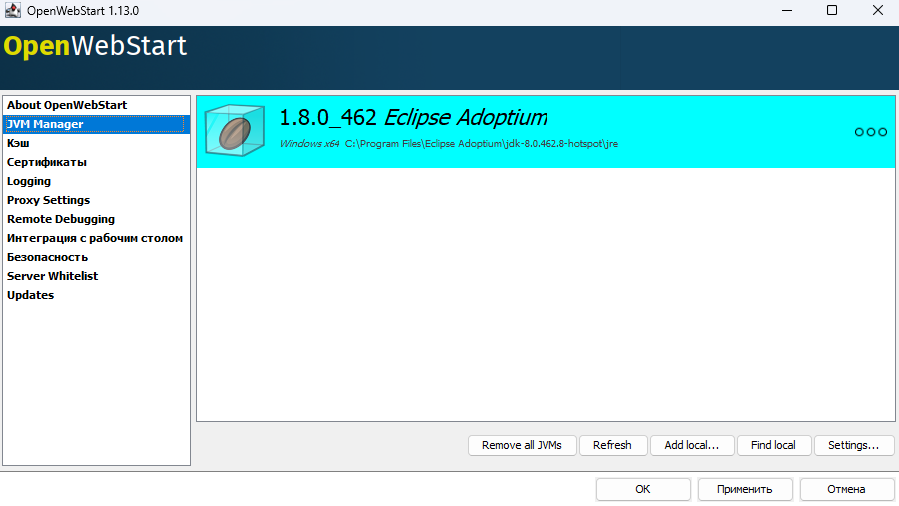
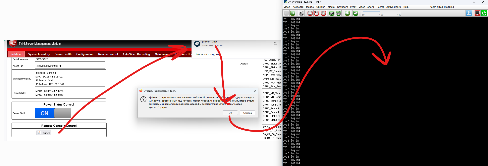

# Megarac SP Java console
Как получить картинку из старого Megarac на jnlp?

Если кратко, то нужно:
- Поставить старую джаву
- Включить устаревшие методы шифрования

### 1. Подготовка BMC
Идём в Идём в BMC web ui => `Configuration` => `Remote Session` => делаем как на скрине => `save`

### 2. Установка и настройка [OpenJDK 8](https://adoptium.net/en-GB/temurin/releases?version=8)
:::note Temurin JDK
OpenJDK Based: Eclipse Temurin offers high-performance, cross-platform, open source Java™ Runtimes binaries that are enterprise-ready and Java SE TCK certified and AQAvit verified for general use in the Java Ecosystem.
:::

Скачиваем 8 (!!!) версию с официального сайта или с зеркала ([OpenJDK8U-jdk_x64_windows_hotspot_8u472b08.msi](@storageBaseUrl@/tools/OpenJDK-temurin_8/OpenJDK8U-jdk_x64_windows_hotspot_8u472b08.msi)) и устанавливаем. Далее идём по пути `"C:\Program Files\Eclipse Adoptium\jdk-8.0.462.8-hotspot\jre\lib\security"` и кладём туда с заменой правленый [`java.security`](@storageBaseUrl@/tools/OpenJDK-temurin_8/java.security)

### 3. Установка и настройка [OpenWebStart](https://openwebstart.com/)
:::note OpenWebStart
OpenWebStart is an open source reimplementation of the Java Web Start technology. It provides the most commonly used features of Java Web Start and the JNLP standard, so that your customers can continue using applications based on Java Web Start and JNLP without any change.
:::
Скачиваем последнюю версию с официального сайта или с зеркала ([OpenWebStart_windows-x64_1_13_0.exe](@storageBaseUrl@/tools/OpenWebStart_1.13.0/OpenWebStart_windows-x64_1_13_0.exe)) и устанавливаем

Открываем `OpenWebStart Settings` => `JVM Manager`, удаляем/отключаем всё что там есть, добавляем `C:\Program Files\Eclipse Adoptium\jdk-8.0.462.8-hotspot\jre`. Должно получитсья что то такое

### 4. Запускаем
Идём в BMC web ui, скачиваем jnlp, просто кликаем по нему (если openwebstart предложит что то обновить, то отказывайтесь)

