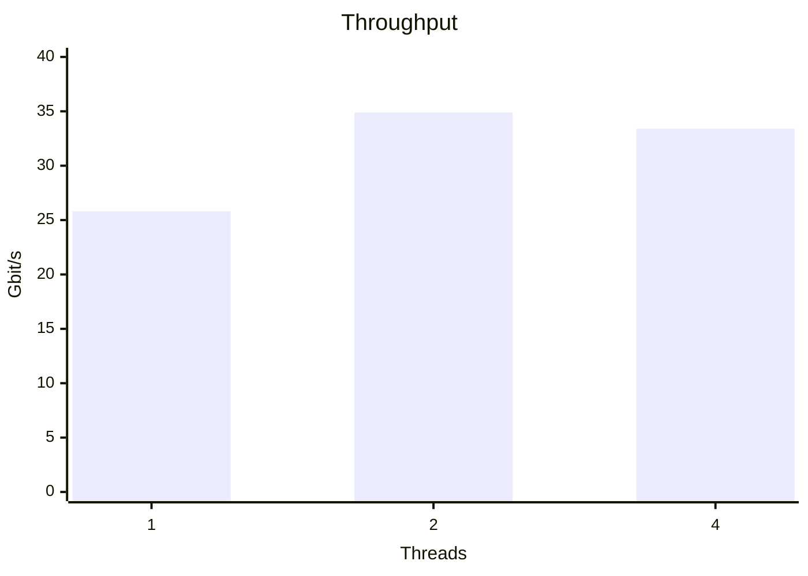

import CodeBlock from "@theme/CodeBlock";
import iperfResult from "!!raw-loader!./iperf-output.txt";

# Mellanox ConnectX-3 Pro 40GbE NIC

Very cheap qsfp+ card CX314A

## Benefits

- 10/40/56Gb/s connectivity for servers and storage
- World-class cluster, network, and storage performance
- Cutting edge performance in virtualized overlay networks (VXLAN and NVGRE)
- Guaranteed bandwidth and low-latency services
- I/O consolidation
- Virtualization acceleration
- Power efficient
- Scales to tens-of-thousands of nodes

## Key Features

- 1us MPI ping latency
- Up to 40/56 Gigabit Ethernet per port
- Single- and Dual-Port options available
- PCI Express 3.0 (up to 8GT/s)
- CPU offload of transport operations
- Application offload
- Precision Clock Synchronization
- HW Offloads for NVGRE and VXLAN encapsulated traffic
- End-to-end QoS and congestion control
- Hardware-based I/O virtualization
- 17mm x 17mm RoHS-R6

## Docs

- [ConnectX-3.book](@storageBaseUrl@/docs/connectx-3-pro-ethernet-single-and-dual-qsfp+-port-adapter-card-user-manual.pdf)
- [PRODUCT BRIEF](@storageBaseUrl@/docs/connectx-3-pro-PRODUCT-BRIEF.pdf)

## Benchmark

Env:

- ubuntu server 24
- dual intel xeon 8368



<details>
  <summary>commands</summary>

```bash title="commands"
ip netns add ns_eth0
ip netns add ns_eth1

ip link set cx0p0 netns ns_eth0
ip link set cx0p1 netns ns_eth1

ip netns exec ns_eth0 ip addr add dev cx0p0 10.10.0.1/24
ip netns exec ns_eth1 ip addr add dev cx0p1 10.10.0.2/24

ip netns exec ns_eth0 ip link set cx0p0 up
ip netns exec ns_eth1 ip link set cx0p1 up

ip netns exec ns_eth0 ip l set mtu 9900 cx0p0
ip netns exec ns_eth1 ip l set mtu 9900 cx0p1

cpupower frequency-set -g performance
ip netns exec ns_eth0 iperf3 -s
ip netns exec ns_eth1 iperf3 -c 10.10.0.1 -P1
ip netns exec ns_eth1 iperf3 -c 10.10.0.1 -P2
ip netns exec ns_eth1 iperf3 -c 10.10.0.1 -P4
```

</details>

<details>
  <summary>iperf3 raw results</summary>
  <CodeBlock>{iperfResult}</CodeBlock>
</details>
