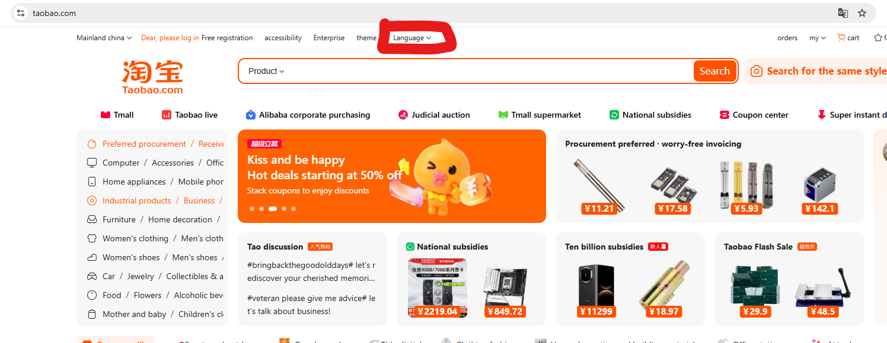
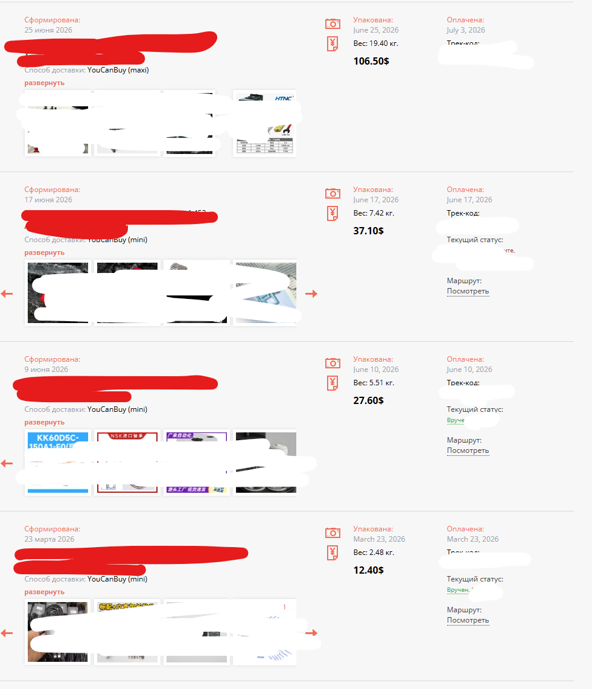

# Способы закупа в китае
Тут немного о том как лично я вожу из китая и немного хинтов.

## Форвардер
Тут будет использован https://www.youcanbuy.ru/articles/ycb_article/ycb_registration/

Регнись там в начале.

## Закупаемся на taobao

### 1. Регистрация

https://www.youcanbuy.ru/articles/ycn_taobao/taobao_reg/

Сразу через настройки поставь пароль т.к. не всегда приходят смс и привяжи alipay.

Желательно делай это всё с нормально IP, не под буквами, а то есть риск получить бан.

### 2. Указание склада
https://www.youcanbuy.ru/articles/ycn_taobao/taobao_address/

### 3. Сбор корзины
Глобально есть два варианта искать и заказывать.
1. Сайт https://www.taobao.com/
2. Приложение https://play.google.com/store/apps/details?id=com.taobao.taobao

На сайте есть встроенная фича перевода на англ 

На телефоне можно использовать фичу гугла с постоянным переводом всего что на экране.

### 4. Заказ на склад в китае
Всё по наитию. Из особенностей лучше это делать с телефона, если вам предлагают оплату картой, то провалитесь в подменю и там будет алипэй.

После того как на тао в заказах появится трек номер, идём на ycb и вбиваем свой заказ в `Покупки`

## Везём закупленное в РФ
На этом этапе нужно решить что и в какие посылки объединять. 

Глобально в ycb есть два варианта доставки. У каждого свои особенности и ограничения.

1. Вариант mini
    - до 20кг
    - белая доставка на твоё физ лицо с налогом на превышение 200 евро (трекать статус и оплачивать превышение на https://cellog.ed22.ru/)
    - идёт через дальний восток
    - оплата наложным платежом через CDEK
    - мне выходит в среднем 650-750р/кг
    - доставка +- месяц
    - есть подробный трекинг

2. Вариант maxi
    - от 10кг
    - серая доставка на юр лицо юкб
    - идёт через Казахстан в мск, а оттуда до конкретного адреса
    - оплата двумя частями. 1я часть переводом физику на левую карту, вторая часть cdek по стране наложным платежом
    - трекинг только от мск и дальше

Для mini лучше никогда не попадать на превышение 200 евро т.к. вам придётся оплатит 700р фикс + налог и ещё это всё затянет время на таможке. Лучше разбивайте на две.
Если вы достаточно рисковый человек, то можно попросить продавца на тао сделать специальный лот с заниженными ценником что бы если что пруфанут на таможне, но я не рекомендую.

Если у вас при закидывании денег для maxi счёт на сайте не изменился за 5+ дней, то пишите в саппорт.
